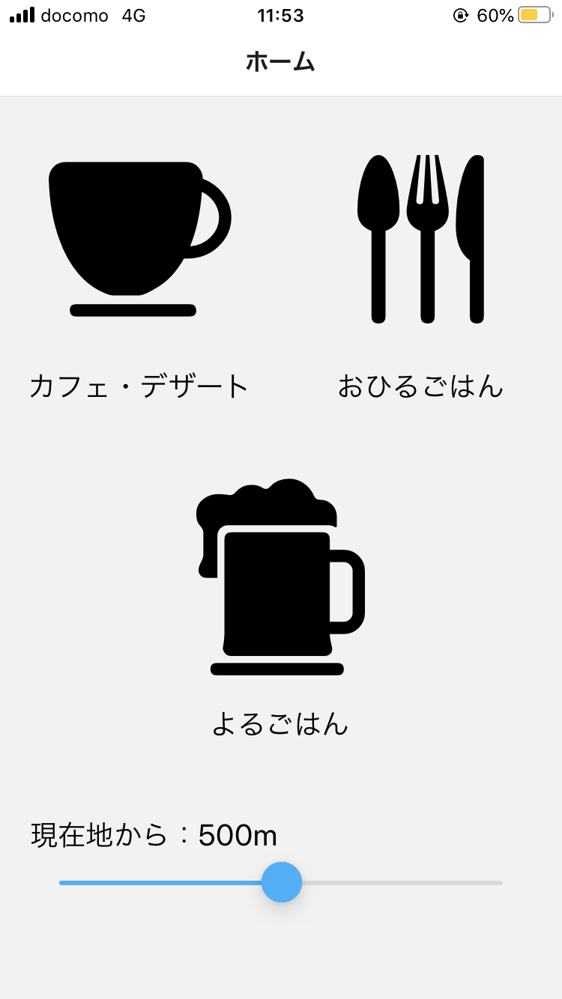

# RestaurantSearch
## アプリ概要
* 現在地周辺の飲食店を検索する。

## 画面イメージ


## 使用機能（デフォルトの機能以外）
* React Navigation & createStackNavigator
    * 画面遷移時に使用する。
    * インストールコマンド
        ```
        npm install @react-navigation/native
        expo install react-native-gesture-handler react-native-reanimated react-native-screens react-native-safe-area-context @react-native-community/masked-view
        npm install @react-navigation/stack
        ```
* expo-constants
    * 定数管理（APIキーを管理する）
    * インストールコマンド
        ```
        expo install expo-constants
        ```
* axios
    * HTTP通信を行うライブラリ
    * 今回はAPIを叩くときに使う
    * インストールコマンド
        ```
        npm install axios
        ```

## 以前ReactNative触ったときのメモ
* [/ReactNative/開発時メモ](https://www.atsumare-senomori.com/5f03d83da681a0335d44dc1a)
